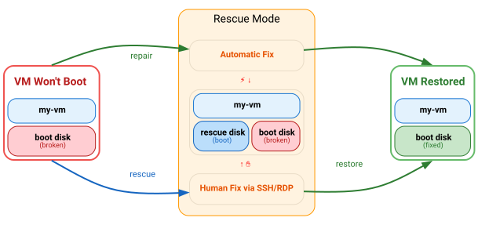

# GCE Rescue

[](https://github.com/GoogleCloudPlatform/gce-rescue/actions/workflows/v2-ci.yml?query=branch%3Amain)
[](https://pypi.org/project/gce-rescue/)
[](https://pypi.org/project/gce-rescue/)
[](https://github.com/GoogleCloudPlatform/gce-rescue/blob/main/LICENSE)

Rescue unbootable Google Compute Engine VMs by swapping disks on the same VM — no new instance created, same IP, no data loss. Creates a safety snapshot before any changes.

**Auto-fix path**: The `repair` command reads serial console output, identifies
the boot failure, and applies a fix automatically end to end.

**Rescue path**: When auto-fix is not available for the detected issue, the
`rescue` command swaps your broken boot disk with a rescue disk and attaches the
original boot disk as a secondary disk, providing a rescue environment for manual
repair. Once fixed, the `restore` command puts your fixed boot disk back.

```bash
gce-rescue diagnose my-vm --zone=us-central1-a    # What's wrong?
gce-rescue repair my-vm --zone=us-central1-a      # Auto-fix it
```

<p align="center">
  
</p>

> **Note**: GCE Rescue is not an officially supported Google Cloud product. The Google Cloud Support team maintains this repository.

**Requirements:** Python >= 3.9, [gcloud CLI](https://cloud.google.com/sdk/docs/install), `roles/compute.instanceAdmin.v1` IAM role.

## Installation

### Google Cloud Shell (recommended)

Open <a href="https://shell.cloud.google.com" target="_blank">Cloud Shell</a> — Python, gcloud, and authentication are already set up.

```bash
pip install gce-rescue
```

Verify the installation:

```bash
gce-rescue -h
```

> If `gce-rescue` is not found after install, start a new shell session or run:

```bash
export PATH="$HOME/.local/bin:$PATH"
```

<details>
<summary><b>Local Machine</b></summary>
<br>

**Linux / macOS**

```bash
curl -sSL https://raw.githubusercontent.com/GoogleCloudPlatform/gce-rescue/main/install.sh | bash
```

May require `sudo` if Python or pip is not installed.

**Windows** (run PowerShell as Administrator)

```powershell
irm https://raw.githubusercontent.com/GoogleCloudPlatform/gce-rescue/main/install.ps1 | iex
```

The installers handle all prerequisites (Python, gcloud, PATH, authentication)
and will prompt before installing anything.

---

**Install from source** (requires Python >= 3.9, [gcloud CLI](https://cloud.google.com/sdk/docs/install), Git)

```bash
git clone https://github.com/GoogleCloudPlatform/gce-rescue.git
cd gce-rescue
pip install .
```

</details>

## Usage

**Start with diagnose** — understand what's wrong (safe, read-only)
   ```bash
   gce-rescue diagnose VM_NAME --zone=ZONE
   ```

**Auto-fix available?** — let repair handle it automatically
   ```bash
   gce-rescue repair VM_NAME --zone=ZONE
   ```

**Already know the fix?** — supply your own fix script (skips diagnosis)
   ```bash
   gce-rescue repair VM_NAME --zone=ZONE --fix-script=fix.sh
   ```
   Ideal for large-scale events where many VMs share one known fix: the script
   runs against the mounted boot disk, then the VM is restored and boot-verified
   automatically. Add `--quiet` for automation.

**Need manual access?** — enter rescue mode, fix it yourself
   ```bash
   gce-rescue rescue VM_NAME --zone=ZONE
   
   # SSH/RDP in, fix the issue on /mnt/sysroot

   gce-rescue restore VM_NAME --zone=ZONE
   ```

| Command | What it does | Modifies VM? |
|---------|-------------|:---:|
| `diagnose` | Identifies boot errors from serial console output | No |
| `repair` | Diagnoses and fixes boot issues automatically | Yes |
| `rescue` | Provides a rescue environment for investigation via SSH/RDP | Yes |
| `restore` | Reverses rescue, puts your fixed boot disk back | Yes |

All operations create a snapshot before changes, roll back automatically on
failure, and can resume if interrupted.

<details>
<summary><b>Sample output: diagnose</b></summary>

```
$ gce-rescue diagnose my-vm --zone=us-central1-a
Diagnosis: my-vm (us-central1-a)
Status:    RUNNING
OS:        Linux (debian-12-bookworm, x86_64, Free)
Result:    Found 1 boot error(s)

  [fstab_bad_uuid] Bad UUID in /etc/fstab (critical)
    Line: UUID=abcd-1234  /data  ext4  defaults  0  2
    Fix:  Remove or correct the fstab entry, then reboot

  Recommended: gce-rescue repair my-vm --zone=us-central1-a
```

</details>

## Authentication

| Environment | Setup |
|---|---|
| Cloud Shell | Pre-authenticated, nothing to do |
| GCE VM (with service account) | Automatic via metadata server |
| GCE VM (without compute scopes) | `gcloud auth application-default login` |
| Local machine | `gcloud auth application-default login` |

More info: [Application Default Credentials](https://cloud.google.com/docs/authentication/provide-credentials-adc)

### Flags

| Flag | Description |
|------|-------------|
| `--zone` | GCP zone (required) |
| `--project` | GCP project (default: current gcloud config) |
| `--no-snapshot` | Skip safety snapshot (faster) |
| `--rescue-image` | Custom rescue disk image URL (must match VM's OS family + architecture). Useful for restricted-image org policies or hardened rescue environments. Available for `rescue` and `repair`. |
| `--fix-script` | Path to a custom fix script (bash on Linux, PowerShell on Windows) to run against the affected disk after it is mounted — skips diagnosis. With `repair` the VM is restored and boot-verified afterwards; with `rescue` it stays in rescue mode for inspection. The affected disk is mounted at `/mnt/sysroot` on Linux; on Windows its partitions get drive letters from `D:` onward (iterate non-`C:` volumes rather than assuming `D:`). |
| `--verification-timeout` | Seconds to wait for the rescue VM startup script to complete (serial console marker). Overrides the OS-aware default (Linux: 300, Windows: 600). Raise it for slow-booting VMs. Available for `rescue` and `repair`. |
| `--quiet` | No confirmation prompts (for automation) |
| `--format` | Output format: `json`, `yaml`, `table` |

### Update check

At the end of `rescue`, `restore`, `diagnose`, and `repair`, the CLI checks PyPI
(`https://pypi.org/pypi/gce-rescue/json`) for a newer release and prints an
upgrade notice to stderr if one exists. The check runs at most once every 24
hours (cached in `~/.config/gce-rescue/version-check.json`), never delays or
fails a command, and is skipped entirely with `--quiet`, with machine-readable
`--format` values, or when the environment variable
`GCE_RESCUE_DISABLE_VERSION_CHECK=1` is set — use the variable in restricted
networks where outbound calls to pypi.org are unwanted.

## Features

| Feature | Description |
|---------|-------------|
| **Linux + Windows** | Auto-detects OS, uses appropriate rescue environment |
| **Boot Diagnostics** | Serial console analysis for fstab, GRUB, kernel, filesystem errors |
| **Auto-Repair** | Automated fix for fstab errors (more categories planned) |
| **Custom Fix Scripts** | Bring your own fix (`--fix-script`) for known issues at scale — no diagnosis needed |
| **Automatic Rollback** | Operations roll back on failure |
| **Session Recovery** | Resume or rollback interrupted operations |
| **Safety Snapshots** | Backup snapshot before any changes (default) |
| **ARM64 Support** | Automatic architecture detection |

## Permissions

`roles/compute.instanceAdmin.v1` includes all permissions needed for every command.

| Command | Minimum Role |
|---------|-------------|
| `diagnose` | `roles/compute.viewer` |
| `rescue`, `restore`, `repair` | `roles/compute.instanceAdmin.v1` |

```bash
gcloud projects add-iam-policy-binding PROJECT_ID \
    --member="user:EMAIL" \
    --role="roles/compute.instanceAdmin.v1"
```

<details>
<summary><b>Full permissions matrix</b></summary>
<br>

| Permission | `diagnose` | `repair` | `rescue` | `restore` |
|---|:---:|:---:|:---:|:---:|
| `compute.projects.get` | x | x | x | x |
| `compute.instances.get` | x | x | x | x |
| `compute.instances.getSerialPortOutput` | x | x | x | |
| `compute.instances.stop` | | x | x | x |
| `compute.instances.start` | | x | x | x |
| `compute.instances.attachDisk` | | x | x | x |
| `compute.instances.detachDisk` | | x | x | x |
| `compute.instances.setMetadata` | | x | x | x |
| `compute.disks.create` | | x | x | |
| `compute.disks.delete` | | x | x | x |
| `compute.disks.get` | | x | x | x |
| `compute.disks.createSnapshot` | | x* | x* | |
| `compute.snapshots.create` | | x* | x* | |
| `compute.snapshots.get` | | x* | x* | |
| `compute.snapshots.list` | | x | | x |
| `compute.snapshots.delete` | | x* | x* | |

\* Skippable with `--no-snapshot`

</details>

## V1 Legacy

V1 is available as `gce-rescue-v1` for backward compatibility:

```bash
gce-rescue-v1 -n VM_NAME -z ZONE -p PROJECT
```

See the [V1 documentation](gce_rescue/README.md) for details.

## Uninstall

```bash
pip uninstall gce-rescue

# Linux/macOS (if installed via install script)
rm -rf ~/.gce-rescue
```

## Contact

GCE Rescue Team: gce-rescue-dev@google.com
